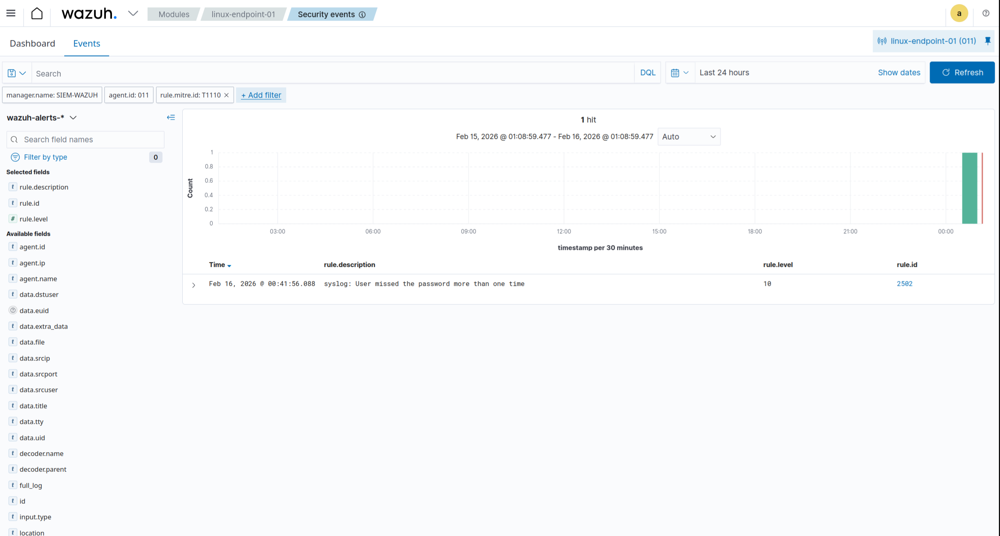

# Hybrid SOC Lab – Azure & Linux Identity Monitoring

## Project Goal
Build a hybrid SOC lab to detect and analyze identity-based attacks 
across on-prem Linux systems and Microsoft Entra ID.

Target Role: SOC Analyst / Cloud Security Intern

---

## Architecture

**On-Prem:**
- Ubuntu Server (Wazuh SIEM)
- Ubuntu Endpoint (SSH log source)
- Log source: /var/log/auth.log

**Cloud:**
- Microsoft Entra ID
- Azure sign-in logs
- Azure audit logs

---

## Attack Simulated

### Linux
- SSH brute force attempts
- MITRE ATT&CK: T1110 (Brute Force)
- Detection via Wazuh rule 2502

### Azure
- Failed Entra ID sign-in attempts
- Identity-based attack validation

---

## Detection Pipeline

Linux Endpoint  
→ Wazuh Agent  
→ Wazuh Manager  
→ Filebeat  
→ Wazuh Indexer (OpenSearch)  
→ Wazuh Dashboard  

---

## Skills Demonstrated

- SIEM deployment (Wazuh)
- Linux log analysis
- File Integrity Monitoring (FIM)
- SSH brute force detection
- Azure Entra ID log analysis
- Troubleshooting log ingestion pipeline
- MITRE ATT&CK mapping

---

## Documentation

Detailed setup and analysis available in `/Documentation`

## Wazuh – SSH Brute Force Detection

### Attack Simulation

The following screenshot shows the simulated SSH brute force attempts against the Linux endpoint:

### Authentication Failure Overview

Wazuh dashboard showing authentication failures:

### Event Details – Rule 2502

Detailed view of the triggered alert, showing rule 2502 and MITRE mapping (T1110 – Brute Force):

### Brute Force Alert Summary

Summary of brute force alerts logged by Wazuh:

## Azure Entra ID – Failed Sign-in Detection

### Failed Sign-in List

The list shows multiple failed login attempts in Azure Sign-in logs:

### Failed Sign-in Details

Detailed event view showing failure status, error code, and failure reason:

---

## Key Learnings

- End-to-end SIEM troubleshooting (Agent → Manager → Indexer → Dashboard)
- Log ingestion debugging (401 Unauthorized / Filebeat issues)
- Azure identity attack simulation and log validation
- Practical MITRE ATT&CK mapping in real detection scenarios
- Hybrid monitoring (On-prem + Cloud)

---

## Author

Jabril Jama  
Aspiring SOC Analyst | Cloud Security  
---

## Key Learnings

- End-to-end SIEM troubleshooting (Agent → Manager → Indexer → Dashboard)
- Log ingestion debugging (401 Unauthorized / Filebeat issues)
- Azure identity attack simulation and log validation
- Practical MITRE ATT&CK mapping in real detection scenarios
- Hybrid monitoring (On-prem + Cloud)

---

## Author

Jabril Jama  
Aspiring SOC Analyst | Cloud Security  

